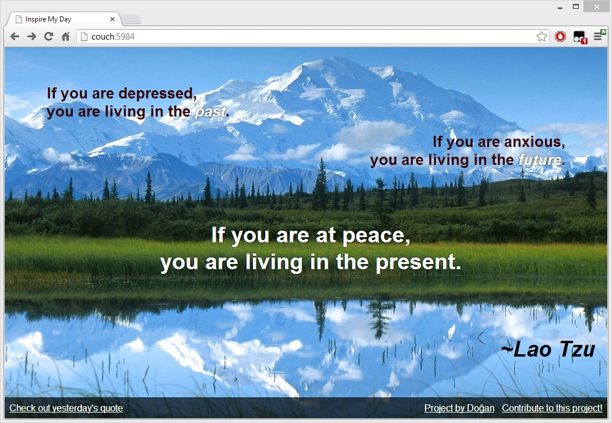

# couchapp-inspiremyday
A basic CouchApp project. I was trying to replicate inspiremyday.com which gives users a daily inspirational quote. I made this app static, so there are no ajax requests.

## Documents

Every quote has its own document with `_id` corresponding to a date (like this `20130302`), a page for quote itself (`quote.html`) and a stylesheet for styling the quote (`style.css`).

## Rewrites

**Main page (today):**

    http://127.0.0.1:5984/inspiremyday/_design/inspiremyday/_list/quote_today/today

becomes

    http://couch:5984/

**Specific date:**

    http://127.0.0.1:5984/inspiremyday/_design/inspiremyday/_show/quote_by_day/20130302

becomes

    http://couch:5984/20130302

**Note: Make sure you have `couch` in your hosts file**

**Note 2: [Set Couchdb vhosts](http://vimeo.com/20773112) `couch:5984` to `/inspiremyday/_design/inspiremyday/_rewrite`**

## Lessons learned

### Static vs Dynamic
When I started this project a day ago, I decided to serve static pages instead of loading quotes dynamically. Using static pages has a disadvantage. You can't check if you have a quote for X date. That's why if some user visits a non-existing quote page (e.g. `/19780324` for 24th March 1978), it will give an error in JSON and there is no way to route "not found" errors AFAIK.

### Don't do this if you are not crazy
I don't like CouchDB or CouchApp, I only did this as an experiment. You can code this project in much better languages and work less. CouchDB is -as its name suggests- a database...

The other thing that annoyed me while working on this was the ***lack* of documentation on everything**.

### You can't load attachments in lists/shows/views
You can only serve them directly!

This disappointed me, [though if you read this Stackoverflow answer, it makes sense](http://stackoverflow.com/a/10037709). Since I can't load my attachments, I wrote a very simple templating script to serve my pages easily (`page_maker.js`). I couldn't do this too if they hadn't added support for CommonJS modules (in v1.1 I believe).

## Helpful stuff
* http://css-tricks.com/perfect-full-page-background-image/
* http://stackoverflow.com/questions/5358183/is-it-possible-to-dynamically-scale-text-size-based-on-browser-width